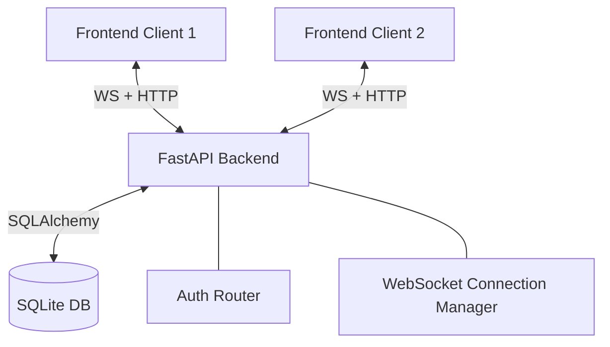

# Signal Clone (SDE Assignment)

## 1. Project Overview
This application is a highly faithful, full-stack clone of the Signal Desktop messaging application, built as an SDE assignment. It replicates the core functionality and visual fidelity of a modern, privacy-focused messaging application. The major supported workflows include real-time direct messaging, group chat creation, contact discovery, and granular message receipts (Sent, Delivered, Read).

## 2. Features

**Mandatory (Implemented):**
- Authentication (Login/Register via Phone or Username)
- Contacts (Global search and contact mapping)
- Conversation list (Direct and Group chats)
- Direct messaging
- Realtime messaging (WebSockets)
- Timestamps and Date tracking
- Delivery / Read receipts
- Real-time typing indicators
- Message persistence (SQLite)
- Groups (Creation and Name assignments)
- Member management (Adding/Leaving groups)
- Signal-style UI (Pill-shaped inputs, message grouping, native dark mode, specific typography and spacing)

**Mocked / Placeholder (Not Implemented):**
- Voice / Video calls (Buttons exist but are inert)
- Stories (Not implemented)
- Linked devices (Not implemented)
- Actual End-to-End Encryption (E2EE) (Messages are stored in plaintext in SQLite for assignment simplicity)
- Attachment/Media uploads (UI affordances exist but backend is text-only)

## 3. Tech Stack
- **Frontend**: Next.js (React), TypeScript, Tailwind CSS, Zustand (State Management), React-Textarea-Autosize
- **Backend**: Python, FastAPI
- **Database**: SQLite
- **ORM**: SQLAlchemy
- **WebSockets**: FastAPI native WebSockets
- **Testing**: Manual browser-based E2E concurrent testing
- **Deployment**: Unconfigured (Designed for local execution)

## 4. Architecture
- **Frontend**: A React-based SPA utilizing Next.js App Router. State is managed globally via Zustand (`useChatStore`, `useAuthStore`) and synchronized with a React Context (`WebSocketContext`) that manages the persistent WebSocket connection, exponential backoff, and event dispatching.
- **Backend**: A FastAPI application separated into logical routers (`auth`, `users`, `conversations`, `ws`).
- **Database**: Relational SQLite database tracking users, conversations, memberships, and messages.
- **WebSocket Layer**: A centralized in-memory `ConnectionManager` tracks active WebSocket connections mapped to `user_id`s, handling targeted broadcasts and fan-outs.
- **Authentication**: JWT-based. HTTP requests use the `Authorization: Bearer <token>` header. WebSocket connections pass the JWT via a query string `?token=<token>`.



## 5. Project Structure
- `backend/`
  - `api/routers/` - REST API endpoints and the WebSocket endpoint.
  - `core/` - Security (JWT hashing) and configuration.
  - `db/` - SQLAlchemy models and DB connection logic.
  - `schemas/` - Pydantic models for validation.
  - `ws/` - The `ConnectionManager` class.
  - `scripts/` - Database seeding scripts.
- `frontend/`
  - `src/app/` - Next.js routing and top-level pages (Login, Register, Home).
  - `src/components/` - Isolated UI elements (`ChatArea`, `Sidebar`, Modals).
  - `src/contexts/` - WebSocket Provider.
  - `src/stores/` - Zustand global state stores.
  - `src/lib/` - Axios configuration and API wrappers.

## 6. Authentication
- **Registration**: Accepts phone number, username, display name, and password. 
- **Mocked OTP**: The assignment required OTP. In this implementation, the "OTP" is mocked as a standard text-based password input for simplicity during evaluation.
- **Login**: Verifies credentials and returns a JWT access token.
- **Logout**: Clears the Zustand store and removes the JWT from local storage.
- **Session Persistence**: Implemented via Zustand's `persist` middleware, which syncs the auth state to `localStorage`.
- **Protected APIs**: HTTP endpoints use `Depends(get_current_user)` to validate the JWT.
- **WebSocket Auth**: Validates the JWT parsed from the `?token=` query parameter before accepting the WebSocket connection.

## 7. Database Schema

- **`User`**: Tracks `phone_number`, `username`, `display_name`, `hashed_password`.
- **`Contact`**: A bridging table tracking known users (`user_id`, `contact_id`).
- **`Conversation`**: Tracks the chat container. `is_group` (boolean integer), `name` (for groups). 
  - *Direct Conversations*: `is_group=0`, strictly 2 members.
  - *Group Conversations*: `is_group=1`, 3+ members, named.
- **`ConversationMember`**: Maps users to conversations. Fields: `conversation_id`, `user_id`, `role` (admin/member).
- **`Message`**: Tracks actual payloads. Fields: `conversation_id`, `sender_id`, `content`, `created_at`.
- **`MessageReceipt`**: Tracks read state. Fields: `message_id`, `user_id`, `status` (sent/delivered/read). 
  - *Why separated?* In group chats, a single message has multiple recipients, each with independent read/delivery states.

## 8. API Documentation

| Method | Endpoint | Purpose | Auth Required | Request/Response |
|---|---|---|---|---|
| POST | `/auth/register` | Create user | No | Req: phone/username, pass. Res: JWT |
| POST | `/auth/login` | Authenticate | No | Req: phone/username, pass. Res: JWT |
| GET | `/auth/me` | Fetch active user | Yes | Res: User object |
| GET | `/users/search?query=X` | Find contacts | Yes | Res: Array of Users |
| GET | `/conversations/` | List user's chats | Yes | Res: Array of Conversations + last msg |
| POST | `/conversations/` | Create DM / Group | Yes | Req: `is_group`, `name`, `member_ids` |
| GET | `/conversations/{id}/messages` | Chat history | Yes | Res: Array of Messages + Receipts |
| DELETE | `/conversations/{id}/members/{uid}` | Leave group | Yes | Res: Success boolean |

## 9. WebSocket Protocol
- **Connection**: `ws://localhost:8000/ws?token=<JWT>`
- **Client Sent Events**:
  - `{ "type": "chat_message", "conversation_id": 1, "content": "Hello" }`
  - `{ "type": "typing.start", "conversation_id": 1 }`
  - `{ "type": "typing.stop", "conversation_id": 1 }`
  - `{ "type": "message.receipt_updated", "message_id": 12, "status": "read" }`
- **Server Broadcast Events**:
  - `{ "type": "new_message", "message": { ...MessageObject } }`
  - `{ "type": "typing.start", "user_id": 2, "conversation_id": 1 }`
  - `{ "type": "message.receipt_updated", "message_id": 12, "user_id": 2, "status": "read" }`
- **Error Handling**: Invalid JWT drops connection with `1008 Policy Violation`. Frontend implements automatic exponential backoff reconnection.

## 10. Seed Data
The application ships with a robust data engineering script that drops the DB and rebuilds an intricate web of demo data to immediately demonstrate message grouping, receipts, and group dynamics.

- **Command**: `python scripts/seed.py` (run from `backend/`)
- **Demo Credentials**: Phone: `+15550001111` / Password: `pass`
- **Available Users**: 10 users (Alice, Bob, Charlie... Julia)
- **Demo Content**: 5 direct conversations, 3 groups (e.g. "Project Phoenix"), staggered multi-day timestamps, and pre-calculated read/delivered receipts.

## 11. Local Setup

**Backend:**
```bash
cd backend
pip install -r requirements.txt
# Generate database and demo data
python scripts/seed.py 
# Run server
uvicorn main:app --port 8000
```

**Frontend:**
```bash
cd frontend
npm install
npm run dev
```
The app will be available at `http://localhost:3000`.

## 12. Testing
Currently, testing relies on manual concurrent browser execution. Open two instances of `localhost:3000` (e.g., standard browser and incognito), log in as Alice and Bob, and verify realtime delivery, typing indicators, and receipt updates across windows.

## 13. Deployment
- **Frontend**: Standard Next.js static or Node build. Environment variables required: `NEXT_PUBLIC_API_URL`, `NEXT_PUBLIC_WS_URL`.
- **Backend**: Standard Uvicorn/FastAPI deployment. 
- **Considerations**: The current `ConnectionManager` stores WebSocket connections in memory. If deployed across multiple load-balanced nodes, you *must* implement a Redis Pub/Sub layer to broadcast WebSocket messages across instances, or sticky sessions.

## 14. Design Decisions
- **WebSockets vs Polling**: WebSockets chosen for true real-time, low-latency typing indicators and delivery receipts required by modern messengers.
- **Unified Conversation Model**: 1:1 and Group chats share the exact same `Conversation` table, differing only by an `is_group` flag and member count. This drastically simplifies SQL queries and frontend mapping.
- **Message Receipts**: Rather than a simple boolean, receipts are an independent relational table. This is technically necessary for Group Chats where Alice's message might be Read by Bob, but only Delivered to Charlie.
- **E2EE Omission**: Real Signal implements the Double Ratchet algorithm. This requires immense cryptographic overhead (PreKeys, Identity Keys, Signed PreKeys) that is completely out of scope for a UX/UI-focused product assignment. 

## 15. Known Limitations
- Messages are stored in plaintext in the SQLite database.
- Scalability is limited: SQLite blocks concurrent heavy writes, and the in-memory WS manager prevents multi-node horizontal scaling.
- No media, image, or file upload support.
- Native mobile device edge-cases (like iOS Safari bottom bar clipping) have not been rigorously mitigated.

## 16. Interview Notes
*Key architectural defense points for the developer:*
1. **Why SQLite?** Zero-configuration setup ensures the evaluator can run the app immediately. The schema was built with SQLAlchemy, meaning swapping to PostgreSQL is a 1-line connection string change.
2. **State Management**: Zustand was preferred over Redux for minimal boilerplate while perfectly handling the asynchronous complexities of WebSocket message injection.
3. **Receipt Complexity**: Be prepared to explain why the `MessageReceipt` table exists (Fan-out complexity in group chats) and how the WebSocket dynamically updates the specific message UI.
4. **WebSocket Loop Safety**: Explain the implementation of `list(self.active_connections[conversation_id].items())` in the broadcast loop to prevent `RuntimeError: dictionary changed size during iteration` when a socket disconnects mid-broadcast.
